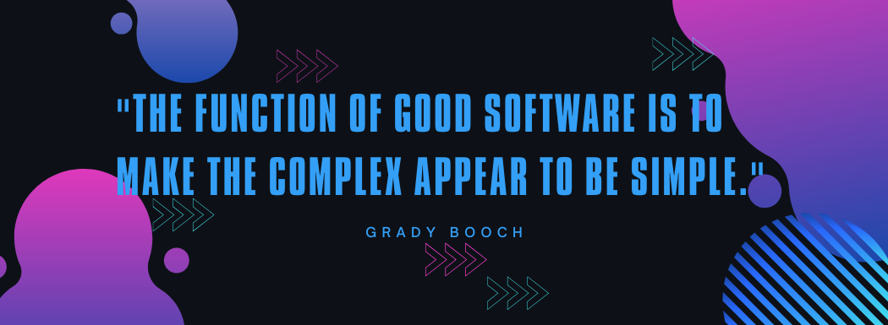

## About me:
I'm **Mariana Pereira**, and my passion for programming and technology has been a constant driving force throughout my journey. While pursuing my degree in ``Chemical Engineering``, I expanded my technical skills by delving into **Python**, applying web scraping techniques, and working with artificial neural networks during insightful internships.

Currently, I am also a student at the ``42 School's Common Core`` program, where I am honing my expertise in **Shell Scripting**, **C**, **C++**, and more. This unique project-based and peer-to-peer learning environment has allowed me to develop not only technical proficiency but also collaboration and problem-solving skills.

With a strong foundation in engineering and a growing repertoire of programming tools, I am excited to tackle challenges at the intersection of technology and innovation.

- Languages: ``C``  ``C++``  ``Python``
- Interest in Machine Learning and Artificial Inteligence
- Currently completing the ``Common Core`` at 42 Porto
- Currently completing the ``Chemical Engineering degree`` at FEUP

  

