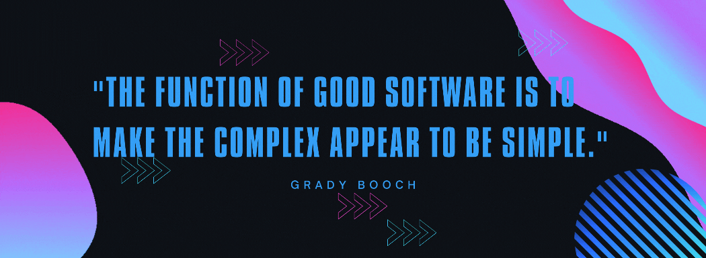

<h1 align="center">Hi 👋, I'm MARIANA PEREIRA</h1>

  <!-- Typing SVG by DenverCoder1 - https://github.com/DenverCoder1/readme-typing-svg -->

<!-- 

  <!-- Typing SVG by DenverCoder1 - https://github.com/DenverCoder1/readme-typing-svg -->
<!--  

 -->

## About me:
My passion for programming and technology has been a constant driver throughout my journey. I hold a background in Chemical Engineering from FEUP and am now pursuing a Master’s in **Data Science and Engineering** at the Faculty of Engineering of the University of Porto (FEUP).  

During my undergraduate studies, I expanded my technical skills through internships where I applied **Python** for web scraping, data structuring, and predictive modeling using **machine learning** techniques. These experiences strengthened my interest in **AI** and motivated me to advance into data science research and applications.  

Alongside my Master’s, I am completing the **Common Core program at 42 Porto**, a project-based curriculum focused on **C, C++, Shell scripting, and low-level programming**. This environment challenges me daily to write efficient code, debug complex problems, and collaborate effectively in peer-driven projects. Many of the repositories you’ll find here reflect projects from this program as well as personal explorations.  

With a strong engineering foundation and an expanding repertoire of programming tools, I am eager to build solutions at the intersection of **data science, AI, and software development**.  

- 💻 Languages: ``C``  ``C++``  ``Python`` 
- 🧠 Interests: Machine Learning, Artificial Intelligence, Data-Driven Engineering
- 👩🏽‍💻 Currently completing the ``Common Core`` at 42 Porto
- 🎓 Currently completing the ``Master’s in Data Science & Engineering`` at FEUP

## Skills:

  

## My Projects:

 🐍 <b>Python</b>

  
- [Web scraping](https://github.com/mfaria-p/Webscrapping_zeolites.git) ->  Creation of a Database of zeolite properties using web scraping techniques
- [ANN Introduction](https://github.com/mfaria-p/Machine_learning_ANN.git) -> Introduction to Machine Learning, focusing on building and training Artificial Neural Networks using PyTorch
- [ZeoPropNet](https://github.com/mfaria-p/MatPropNet.git) -> A Machine Learning framework designed for predicting various properties of materials using neural network

 🗃️ <b>SQL</b>

- [SQL for Data Science](https://github.com/mfaria-p/SQL_DataScience.git) -> SQL and Python projects showcasing database management and data analysis skills from IBM’s SQL for Data Science course

 🔧 <b>C</b>

### Individual Projects
- [C Piscine](https://github.com/mfaria-p/42-Piscine.git) ->  An intense month-long coding bootcamp learning C, shell scripting, and peer-driven problem-solving
- [Libft](https://github.com/mfaria-p/libft.git) ->  First project of the 42 Common Core, recreating essential C library functions to deepen my understanding and prep for advanced work
- [ft_printf](https://github.com/mfaria-p/ft_printf.git) -> a custom implementation of the printf function in C
- [get_next_line](https://github.com/mfaria-p/get_next_line.git) -> provides a function to read content line by line from files or standard input, essential for sequential text data processing
- [so_long](https://github.com/mfaria-p/so_long.git) -> A 2D tile-based adventure game where a knight collects all the mushrooms before reaching home
- [minitalk](https://github.com/mfaria-p/minitalk.git) -> UNIX signal-based messaging system between a client and a server
- [push_swap](https://github.com/mfaria-p/push_swap.git) -> a stack-based sorting algorithm using minimal operations to efficiently order integers
- [Philosophers](https://github.com/mfaria-p/Philosophers.git) -> A thread-safe simulation of the Dining Philosophers Problem using POSIX threads and mutex locks

### Group Projects
- [minishell](https://github.com/mfaria-p/minishell.git) -> simple shell implementation mimicking GNU Bash, supporting built-in commands, redirections, pipes, and signal handling
- [miniRT](https://github.com/mfaria-p/miniRT.git) ->  lightweight raytracer rendering 3D scenes with ray-object intersection, Phong lighting, and interactive camera/object controls using MiniLibX.

 🤖 <b>C++</b>

- [C++ Modules](https://github.com/mfaria-p/CPP_Modules.git) ->  Mastering C++ from the ground up through the 42 Common Core curriculum – covering OOP, memory management, inheritance, templates, STL, and more
- [Arduino Assembly line](https://github.com/mfaria-p/EBEC_Arduino_Autoline.git) -> Arduino-based auto assembly line with conveyor, crane, stamper, and box closer — built in 24h for EBEC '25.

  
  

